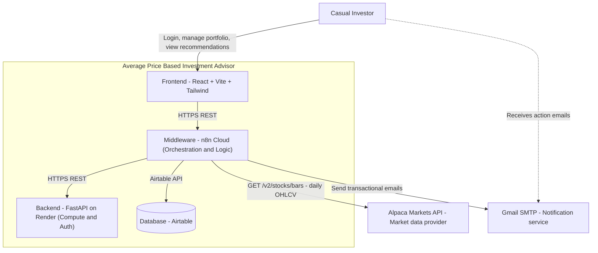

```mermaid
flowchart TB
    User["Casual Investor"]
    
    subgraph System["Average Price Based Investment Advisor"]
        direction TB
        Frontend["Frontend - React + Vite + Tailwind"]
        Middleware["Middleware - n8n Cloud (Orchestration and Logic)"]
        Backend["Backend - FastAPI on Render (Compute and Auth)"]
        Database[("Database - Airtable")]
        
        Frontend -->|HTTPS REST| Middleware
        Middleware -->|HTTPS REST| Backend
        Middleware -->|Airtable API| Database
    end
    
    Alpaca["Alpaca Markets API - Market data provider"]
    Gmail["Gmail SMTP - Notification service"]
    
    User -->|Login, manage portfolio, view recommendations| Frontend
    User -.->|Receives action emails| Gmail
    
    Middleware -->|GET /v2/stocks/bars - daily OHLCV| Alpaca
    Middleware -->|Send transactional emails| Gmail
```