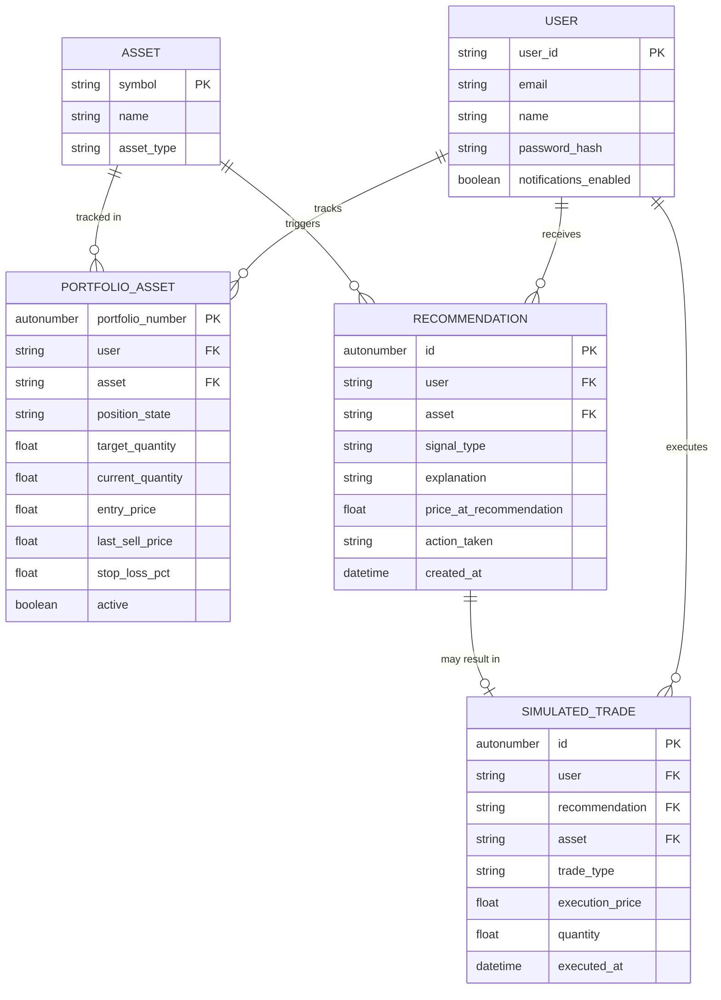

```mermaid
erDiagram
    USER ||--o{ PORTFOLIO_ASSET : "tracks"
    USER ||--o{ RECOMMENDATION : "receives"
    USER ||--o{ SIMULATED_TRADE : "executes"
    ASSET ||--o{ PORTFOLIO_ASSET : "tracked in"
    ASSET ||--o{ RECOMMENDATION : "triggers"
    RECOMMENDATION ||--o| SIMULATED_TRADE : "may result in"

    USER {
        string user_id PK
        string email
        string name
        string password_hash
        boolean notifications_enabled
    }
    ASSET {
        string symbol PK
        string name
        string asset_type
    }
    PORTFOLIO_ASSET {
        autonumber portfolio_number PK
        string user FK
        string asset FK
        string position_state
        float target_quantity
        float current_quantity
        float entry_price
        float last_sell_price
        float stop_loss_pct
        boolean active
    }
    RECOMMENDATION {
        autonumber id PK
        string user FK
        string asset FK
        string signal_type
        string explanation
        float price_at_recommendation
        string action_taken
        datetime created_at
    }
    SIMULATED_TRADE {
        autonumber id PK
        string user FK
        string recommendation FK
        string asset FK
        string trade_type
        float execution_price
        float quantity
        datetime executed_at
    }
```